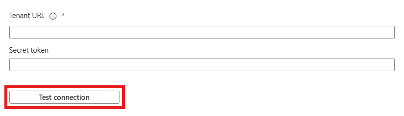

# Configure directprint.io for automatic user provisioning with Microsoft Entra ID

This article describes the steps you need to perform in both directprint.io and Microsoft Entra ID to configure automatic user provisioning. When configured, Microsoft Entra ID automatically provisions and de-provisions users and groups to [directprint.io](https://directprint.io) using the Microsoft Entra provisioning service. For important details on what this service does, how it works, and frequently asked questions, see [Automate user provisioning and deprovisioning to SaaS applications with Microsoft Entra ID](~/identity/app-provisioning/user-provisioning.md). 

## Capabilities supported
> [!div class="checklist"]
> * Create users in directprint.io.
> * Remove users in directprint.io when they don't require access anymore.
> * Keep user attributes synchronized between Microsoft Entra ID and directprint.io.
> * Provision groups and group memberships in directprint.io.
> * [Single sign-on](directprint-io-cloud-print-administration-tutorial.md) to directprint.io (recommended).

## Prerequisites

The scenario outlined in this article assumes that you already have the following prerequisites:

* [A Microsoft Entra tenant](~/identity-platform/quickstart-create-new-tenant.md). 
* One of the following roles: [Application Administrator](/entra/identity/role-based-access-control/permissions-reference#application-administrator), [Cloud Application Administrator](/entra/identity/role-based-access-control/permissions-reference#cloud-application-administrator), or [Application Owner](/entra/fundamentals/users-default-permissions#owned-enterprise-applications). 
* Single sign-on with Microsoft Entra ID is completed.
* A licensed or 30 days free trial account with directprint.io.

## Step 1: Plan your provisioning deployment
1. Learn about [how the provisioning service works](~/identity/app-provisioning/user-provisioning.md).
1. Determine who's in [scope for provisioning](~/identity/app-provisioning/define-conditional-rules-for-provisioning-user-accounts.md).
1. Determine what data to [map between Microsoft Entra ID and directprint.io](~/identity/app-provisioning/customize-application-attributes.md). 

## Step 2: Configure directprint.io to support provisioning with Microsoft Entra ID

1. log into your [directprint.io account](https://directprint.io/login/).
1. Navigate to the Microsoft Entra SSO and Provisioning screen.
1. Save the Tenant URL and secret toke for future reference. You need it in **Step 5**.

## Step 3: Add directprint.io from the Microsoft Entra application gallery

Add directprint.io from the Microsoft Entra application gallery to start managing provisioning to directprint.io. If you have previously setup directprint.io for SSO you can use the same application. However, we recommend that you create a separate app when testing out the integration initially. Learn more about adding an application from the gallery [here](~/identity/enterprise-apps/add-application-portal.md). 

## Step 4: Define who is in scope for provisioning 

[!INCLUDE [create-assign-users-provisioning.md](~/identity/saas-apps/includes/create-assign-users-provisioning.md)]

## Step 5: Configure automatic user provisioning to directprint.io 

This section guides you through the steps to configure the Microsoft Entra provisioning service to create, update, and disable users and/or groups in directprint.io based on user and/or group assignments in Microsoft Entra ID.

### To configure automatic user provisioning for directprint.io in Microsoft Entra ID:

1. Sign in to the [Microsoft Entra admin center](https://entra.microsoft.com) as at least a [Cloud Application Administrator](~/identity/role-based-access-control/permissions-reference.md#cloud-application-administrator).
1. Browse to **Entra ID** > **Enterprise apps**

	

1. In the applications list, select **directprint.io**.

	

1. Select the **Provisioning** tab.

	

1. Select **+ New configuration**.

	

1. In the **Tenant URL** field, input your directprint Tenant URL and Secret Token. Select **Test Connection** to ensure Microsoft Entra ID can connect to directprint. If the connection fails, ensure your directprint account has the required admin permissions and try again.

      

1. Select **Create** to create your configuration.

1. Select **Properties** on the **Overview** page.

1. Select the **Edit** icon to edit the properties. Enable notification emails and provide an email to receive quarantine notifications. Enable **Accidental deletions prevention**. Select **Apply** to save the changes.

1. In the **Notification Email** field, enter the email address of a person who should receive the provisioning error notifications and select the **Send an email notification when a failure occurs** check box.

   

1. Select **Attribute Mapping** in the left panel and select **Groups**.

1. Review the group attributes that are synchronized from Microsoft Entra ID to directprint.io in the **Attribute-Mapping** section. The attributes selected as **Matching** properties are used to match the groups in directprint.io for update operations. Select the **Save** button to commit any changes.

      |Attribute|Type|Supported for filtering|
      |---|---|---|
      |displayName|String|&check;|
      |externalId|String||
      |members|Reference||

1. To configure scoping filters, refer to the instructions provided in the [Scoping filter article](~/identity/app-provisioning/define-conditional-rules-for-provisioning-user-accounts.md).

1. Use [on-demand provisioning](~/identity/app-provisioning/provision-on-demand.md) to validate sync with a small number of users before deploying more broadly in your organization. 

1. When you're ready to provision, select **Start Provisioning** from the **Overview** page.

## Step 6: Monitor your deployment

[!INCLUDE [monitor-deployment.md](~/identity/saas-apps/includes/monitor-deployment.md)]

## More resources

* [Managing user account provisioning for Enterprise Apps](~/identity/app-provisioning/configure-automatic-user-provisioning-portal.md)
* [What is application access and single sign-on with Microsoft Entra ID?](~/identity/enterprise-apps/what-is-single-sign-on.md)

## Related content

* [Learn how to review logs and get reports on provisioning activity](~/identity/app-provisioning/check-status-user-account-provisioning.md)
