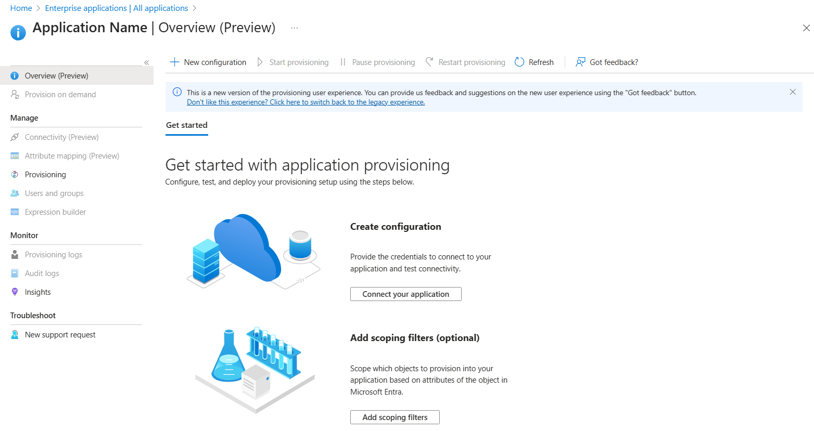

# Configure Ideagen Cloud for automatic user provisioning with Microsoft Entra ID

This article describes the steps you need to perform in both Ideagen Cloud and Microsoft Entra ID to configure automatic user provisioning. When configured, Microsoft Entra ID automatically provisions and de-provisions users and groups to [Ideagen Cloud](https://www.ideagen.com/) using the Microsoft Entra provisioning service. For important details on what this service does, how it works, and frequently asked questions, see [Automate user provisioning and deprovisioning to SaaS applications with Microsoft Entra ID](~/identity/app-provisioning/user-provisioning.md). 

## Capabilities supported
> [!div class="checklist"]
> * Create users in Ideagen Cloud.
> * Remove users in Ideagen Cloud when they don't require access anymore.
> * Keep user attributes synchronized between Microsoft Entra ID and Ideagen Cloud.

## Prerequisites

The scenario outlined in this article assumes that you already have the following prerequisites:

* [A Microsoft Entra tenant](~/identity-platform/quickstart-create-new-tenant.md). 
* One of the following roles: [Application Administrator](/entra/identity/role-based-access-control/permissions-reference#application-administrator), [Cloud Application Administrator](/entra/identity/role-based-access-control/permissions-reference#cloud-application-administrator), or [Application Owner](/entra/fundamentals/users-default-permissions#owned-enterprise-applications). 
* The Tenant URL and Secret Token.

## Step 1: Plan your provisioning deployment
1. Learn about [how the provisioning service works](~/identity/app-provisioning/user-provisioning.md).
1. Determine who's in [scope for provisioning](~/identity/app-provisioning/define-conditional-rules-for-provisioning-user-accounts.md).
1. Determine what data to [map between Microsoft Entra ID and Ideagen Cloud](~/identity/app-provisioning/customize-application-attributes.md). 

## Step 2: Configure Ideagen Cloud to support provisioning with Microsoft Entra ID
1. Log in to Ideagen. Select the **Administration** icon to show the left hand side menu.

	
 
1. Navigate to **Authentication** page under the **Manage tenant** sub menu.

	 

1. Select Edit button and select **Enabled** checkbox under automatic provisioning.

	

1. Select **Save** button to save the changes.

1. Scroll down in the Authentication Page to **Client Token** section and select **Regenerate** .

	

1. **Copy** and save the Bearer Token. This value is entered in the Secret Token * field in the Provisioning tab of your Ideagen Cloud application. 

	

1. Locate the **SCIM URL** and keep the value for later use. This value is used as Tenant URL when configuring automatic user provisioning in Azure portal. 

## Step 3: Add Ideagen Cloud from the Microsoft Entra application gallery

Add Ideagen Cloud from the Microsoft Entra application gallery to start managing provisioning to Ideagen Cloud. If you have previously setup Ideagen Cloud for SSO, you can use the same application. However, we recommend that you create a separate app when testing out the integration initially. Learn more about adding an application from the gallery [here](~/identity/enterprise-apps/add-application-portal.md). 

## Step 4: Define who is in scope for provisioning 

[!INCLUDE [create-assign-users-provisioning.md](~/identity/saas-apps/includes/create-assign-users-provisioning.md)]

## Step 5: Configure automatic user provisioning to Ideagen Cloud 

This section guides you through the steps to configure the Microsoft Entra provisioning service to create, update, and disable users and/or groups in Ideagen Cloud based on user and/or group assignments in Microsoft Entra ID.

### To configure automatic user provisioning for Ideagen Cloud in Microsoft Entra ID:

1. Sign in to the [Microsoft Entra admin center](https://entra.microsoft.com) as at least a [Cloud Application Administrator](~/identity/role-based-access-control/permissions-reference.md#cloud-application-administrator).
1. Browse to **Entra ID** > **Enterprise apps**

	

1. In the applications list, select **Ideagen Cloud**.

	

1. Select the **Provisioning** tab.

	

1. Select **+ New configuration**.

	

1. In the **Tenant URL** field, enter your Ideagen Cloud Tenant URL and Secret Token. Select **Test Connection** to ensure Microsoft Entra ID can connect to Ideagen Cloud. If the connection fails, ensure your Ideagen Cloud account has the required admin permissions and try again.

	

1. Select **Create** to create your configuration.

1. Select **Properties** on the **Overview** page.

1. Select the **Edit** icon to edit the properties. Enable notification emails and provide an email to receive quarantine notifications. Enable **Accidental deletions prevention**. Select **Apply** to save the changes.

1. In the **Notification Email** field, enter the email address of a person who should receive the provisioning error notifications and select the **Send an email notification when a failure occurs** check box.

	

1. Select **Attribute Mapping** in the left panel and select **users**.

1. Review the user attributes that are synchronized from Microsoft Entra ID to Ideagen Cloud in the **Attribute-Mapping** section. The attributes selected as **Matching** properties are used to match the user accounts in Ideagen Cloud for update operations. If you choose to change the [matching target attribute](~/identity/app-provisioning/customize-application-attributes.md), you need to ensure that the Ideagen Cloud API supports filtering users based on that attribute. Select the **Save** button to commit any changes.

   |Attribute|Type|Supported for filtering|Required by Ideagen Cloud|
   |---|---|---|---|
   |userName|String|&check;|&check;|
   |active|Boolean||&check;|
   |displayName|String||&check;|
   |title|String|||
   |emails[type eq "work"].value|String||&check;|
   |preferredLanguage|String|||
   |name.givenName|String||&check;|
   |name.familyName|String||&check;|
   |externalId|String||&check;|

	>[!NOTE]
	>All the required fields (for example, first name, last name and email) are required to be filled in Microsoft Entra ID in order get the auto provision work without any issue. 

1. To configure scoping filters, refer to the instructions provided in the [Scoping filter article](~/identity/app-provisioning/define-conditional-rules-for-provisioning-user-accounts.md).

1. Use [on-demand provisioning](~/identity/app-provisioning/provision-on-demand.md) to validate sync with a small number of users before deploying more broadly in your organization.

1. When you're ready to provision, select **Start Provisioning** from the **Overview** page. 

## Step 6: Monitor your deployment

[!INCLUDE [monitor-deployment.md](~/identity/saas-apps/includes/monitor-deployment.md)]

## More resources

* [Managing user account provisioning for Enterprise Apps](~/identity/app-provisioning/configure-automatic-user-provisioning-portal.md)
* [What is application access and single sign-on with Microsoft Entra ID?](~/identity/enterprise-apps/what-is-single-sign-on.md)

## Related content

* [Learn how to review logs and get reports on provisioning activity](~/identity/app-provisioning/check-status-user-account-provisioning.md)
